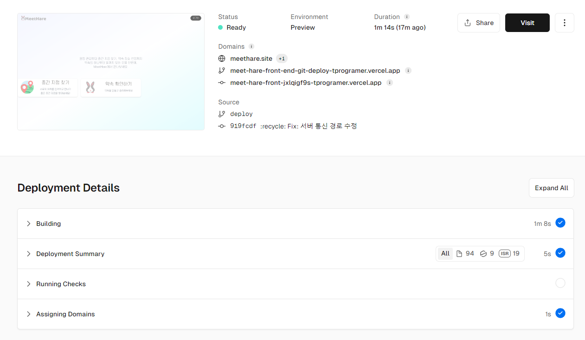
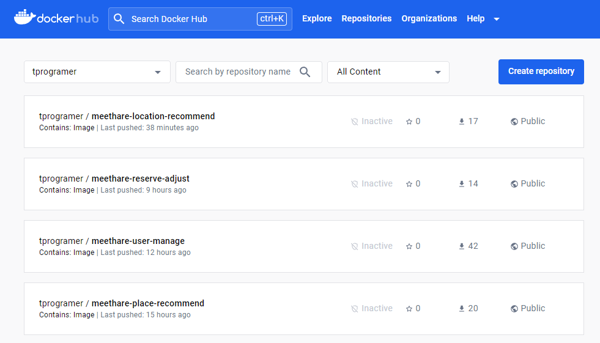
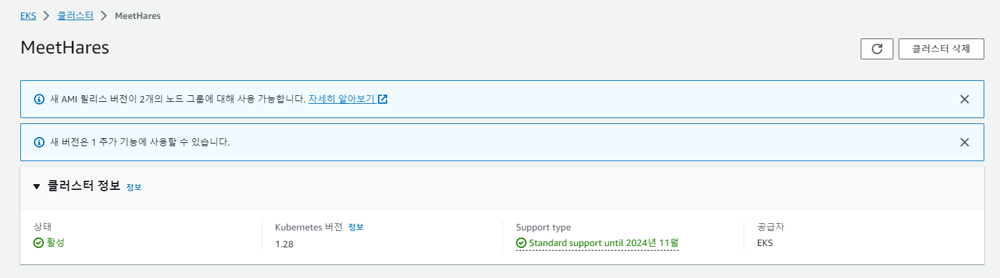
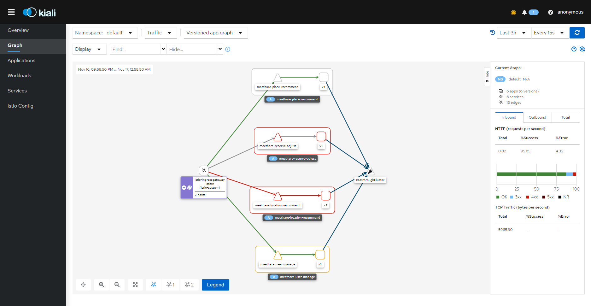
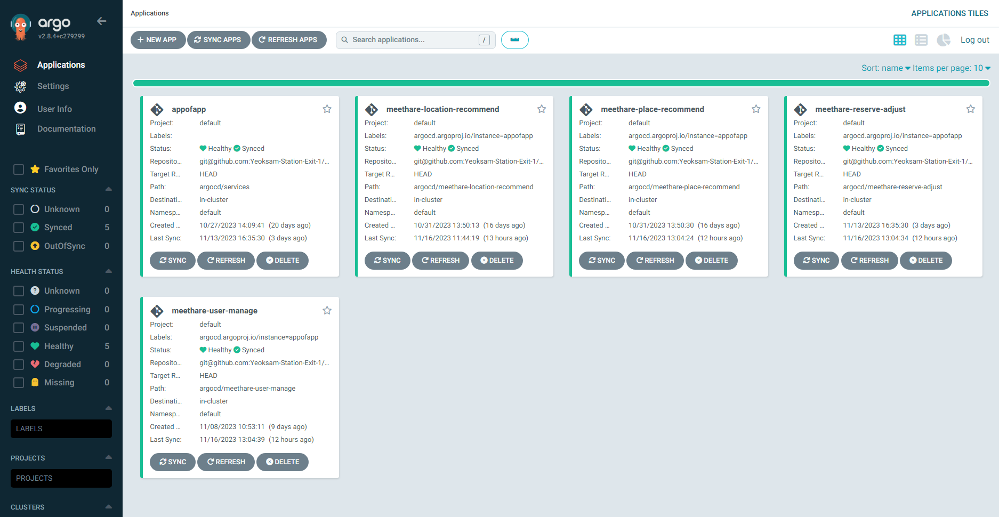

# MeetHare-Infra

시계토끼 앱의 인프라 관리를 위한 Repo 입니다.
아래는 클러스터를 구성한 과정을 담았습니다.

## MeetHare-Front-End

### 빌드를 위한 준비

- node.js 버전 18.16 설치 또는 컨테이너 생성
- MeetHare-Front-End 폴더안에서 아래 명령어 실행

```
# 패키지 매니저 pnpm 전역으로 설치
$ npm i -g pnpm

# pnpm 으로 프로젝트 빌드
$ pnpm build

# 빌드 된 로컬에서 실행해보기
pnpm start
```

### 배포를 위한 준비


저희 팀에서는 Vercel과 연동하여 main 브랜치에 merge 시에 무중단 배포를 진행합니다.  
직접 배포할 경우, 배포 서버에 NGINX와 같은 웹서버를 활용하여 `.next` 빌드 폴더를 배포합니다.

---

## Back-End

### 빌드를 위한 준비

`MeetHare-User-Manage`, `MeetHare-Location-Recommend`, `MeetHare-Place-Recommend`, `MeetHare-Reserve-Adjust`

- 각 서비스 DevContainer 설정과 VSCode의 Dev Containers 익스텐션을 통해 생성된 컨테이너 또는
- 로컬 환경에서 openJDK 11 직접 설치 후, 터미널에서 `./gradlew build` 명령어로 빌드 진행

<aside>
👏 **DevContainer가 처음이시라면**

[MeetHare에서 DevContainer를 개발환경으로 활용한 방법 확인하기](https://four-columnist-4da.notion.site/DevContainers-Docker-IDE-756e4aa7fbc5459d8c80fbc7228ba3d0?pvs=4)

</aside>

### 배포의 경우

저희 팀에서는 EKS 환경에서 Github Actions와 ArgoCD를 통한 무중단 배포를 진행했습니다.


먼저, 각 서비스 폴더에 존재하는 Dockerfile을 활용하여 Docker Image를 로컬에서 직접 생성하거나, main 브랜치 merge로 트리거 되는 Github Action을 통해 생성 후 원하는 Container Registry에 업로드합니다.


동일하게 EKS 환경에서 배포할 경우 `MeetHare-Infra/aws_infra` 폴더에서 `terraform apply` 명령을 통해 동일한 인프라 구축이 가능합니다.  
또는 직접 쿠버네티스 클러스터를 구성할 경우 쿠버네티스의 버전을 1.28으로 설정 후 구성해주시기 바랍니다.


클러스터의 Ingress 요청을 처리하기 위한 AWS ALB와 Istio Ingress-Gateway를 배치하게 됩니다. Istio는 클러스터에 서비스 메쉬 패턴을 위한 오픈소스 서비스로 아래 링크의 istioctl을 설치 후, `istioctl install` 명령을 통해 기본적인 구성이 가능합니다.

[istioctl Release Github](https://github.com/istio/istio/releases)

istio 구성이 완료된 후, `kubectl apply -f MeetHare-Infra/ingress` 명령을 통해 클러스터 네트워크를 구성 후, 아래 링크를 참고하여 클러스터 앞단에 ALB를 배치합니다.

[AWS Load Balancer Controller 공식문서](https://docs.aws.amazon.com/ko_kr/eks/latest/userguide/aws-load-balancer-controller.html)


마지막으로 구성된 쿠버네티스 환경에 Helm을 통해 ArgoCD를 설치 후 `MeetHare-Infra`를 Repository로 등록하면 서비스에 필요한 Pod들이 실행되고 정상적으로 요청을 처리함을 볼 수 있습니다.

### 참고

- 각 서비스의 환경변수와 키값들은 로컬과 동일하게 서비스 폴더 내에 있습니다.
